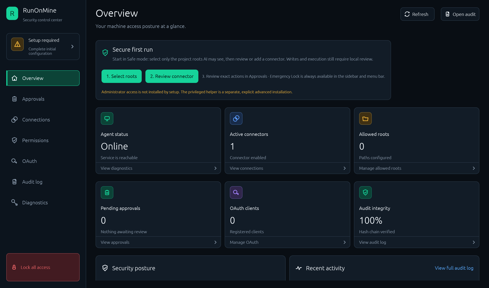

# RunOnMine

<p align="center">
  
</p>

<p align="center"><strong>Let AI work on the machines you own — through a local security boundary you control.</strong></p>

RunOnMine lets an AI assistant use files, terminals, browsers, and desktop
applications on macOS, Linux, or Windows without exposing a raw remote shell.
The model remains in the chosen AI service; every tool call is evaluated on the
owner's machine against connector identity, selected roots, policy, and local
approval.




### Why not direct SSH or a raw MCP server?

| Direct machine access | RunOnMine |
| --- | --- |
| Broad account authority | Capability- and resource-scoped policy |
| Static credential often grants everything | Connector and requester identity are evaluated per call |
| No built-in human checkpoint | Dangerous actions can require exact local approval |
| Public listener or inbound firewall rule | MCP stays on loopback; managed tunnels connect outward |
| Ad-hoc logs | Hash-chained audit records and an emergency lock |

### Three-step local start

```console
runonmine setup --root /absolute/path/to/project
runonmine policy show
runonmine agent run
```

Start with **Safe**. Move to **Developer** only for trusted selected-root coding
work. **Automation** is the CLI `full` preset and is intentionally broad; remote
safety ceilings still apply. The privileged helper is always a separate,
explicit installation and is never installed by setup. See the
[secure onboarding guide](docs/onboarding.md).

> [!IMPORTANT]
> RunOnMine never binds MCP to a public interface, never lets a remote connector
> approve itself, never grants remote administrator execution, and never opens
> the user's daily browser profile for automation.

> [!WARNING]
> RunOnMine is pre-release software. Shell, browser, desktop, and administrator
> tools can make destructive or external changes. The default Safe policy asks
> locally before write or execution operations and denies administrator access.

## Status

Release status is machine-readable. `acceptance/release-candidate.toml` names the
only source revision that may be tagged, while `acceptance/release-gates.toml`
records which candidate-scoped platform and security gates have actually passed.
Evidence below `acceptance/evidence/` is valid only when its `source_revision`
and artifact SHA-256 match that frozen candidate. Historical evidence must never
be relabeled for a newer source revision.

RunOnMine intentionally includes documentation in the frozen source fingerprint.
Commit product, workflow, packaging, and narrative-documentation changes before
freezing a candidate; any later non-evidence change requires a new freeze and
fresh applicable platform acceptance. Owner-controlled native macOS build/package,
CLI, MCP, and desktop smoke results do not replace the physical reboot gate: on a
FileVault-enabled Mac, that gate requires the owner to complete preboot
authentication and sign back into the same account. Hosted jobs that GitHub refuses
to start for account billing/spending reasons likewise remain external blockers,
not product failures. There is no supported public or production release yet.

Implemented connection modes:

- local stdio and opt-in, bearer-authenticated loopback MCP Streamable HTTP;
- Cloudflare Quick Tunnel with a rotating 256-bit secret path for temporary use;
- Cloudflare Named Tunnel with an embedded OAuth 2.1 server pinned to the owner's immutable GitHub numeric ID;
- OpenAI Secure MCP Tunnel through the official external `tunnel-client`.

RunOnMine never binds its MCP server to a public interface. Tunnel processes
connect outward to the loopback listener at `127.0.0.1:47821`. For the named
OAuth connector, the immutable positive GitHub numeric user ID is the sole owner
authority. The login is display metadata only; after a successful same-ID
callback, a safe GitHub rename is atomically reflected in local config.

## Components

- `runonmine`: setup, connectors, policy, approvals, services, audit, and diagnostics;
- `runonmine-agent`: MCP server and connector supervisor;
- `runonmine-desktop`: local security control center for approvals, connector setup and credential rotation, roots, visual principal/resource policy rules, OAuth, audit, and diagnostics;
- `runonmine-helper`: optional, separately installed privileged helper.

The helper is absent by default. Normal setup and user-service installation do
not install it. Executable identity alone never authorizes arbitrary privileged
arguments: `--allow-program` is argument-free, while subcommands, flags,
positional values and path roots require an explicit versioned command profile.
See [`docs/admin-helper.md`](docs/admin-helper.md).

## First local run

```console
runonmine setup --root /absolute/path/to/a/project
runonmine policy show
runonmine agent run
```

In another local MCP client, use stdio:

```console
runonmine mcp stdio --connector <connector-id>
```

Loopback HTTP is disabled by default. Enable it explicitly; the token is never
printed and may be exported only to a new private file:

```console
runonmine connect local-http enable --token-output /absolute/private/local-http.json
runonmine agent run
```

Every request to `http://127.0.0.1:47821/mcp` must include
`Authorization: Bearer <token>`. Rotate or recover it through a new private file
with `--token-output`, or disable it with `runonmine connect local-http disable`.

Use `runonmine ui` for approvals, or approve locally from another terminal with
`runonmine approvals list` and `runonmine approvals approve <id> --once`.
Approvals cannot be granted through MCP. Approval prompts show the concrete
command, path, URL, selector, or script target after local secret redaction.
Ten-minute and persistent approvals apply only to the exact connector, tool, and argument hash that was reviewed. A later explicit `deny` rule always overrides an existing exact-action grant.

Immediately stop the service, reject queued approvals, revoke OAuth sessions,
and invalidate temporary connector credentials with:

```console
runonmine lock
```

For private troubleshooting, generate a bounded support archive instead of
sharing raw configuration, state, or log directories:

```console
runonmine doctor
runonmine doctor --json
runonmine doctor --repair
runonmine support-bundle --output runonmine-support.zip
```

Doctor checks have stable IDs, severity, status, bounded evidence, and remediation.
`--repair` quarantines config-less connector directories, clears orphan ephemeral
runtime state, and removes only credentials recorded in the managed name index
that no longer have a configured connector owner. It does not delete ambiguous
or symlinked entries. JSON diagnostics use the common
`{schema_version, command, data}` envelope.

The schema-v3 ZIP contains generated structural summaries, typed service and
input states, an audit outcome summary, per-entry checksums, and at most five
bounded redacted text-log tails. Its manifest records whether each diagnostic
input was complete, partial, or missing and gives included, skipped, and
truncated counts without exposing source paths. Missing, disabled, corrupt,
unavailable, and permission-denied inputs are reported explicitly instead of
collapsing to one empty or false value.
It excludes raw configuration, the state database, credential stores, browser
profiles, audit arguments, connector identifiers, hostnames, URLs, and selected
filesystem roots. Redaction is defense in depth, so review the ZIP before
sharing it.

## Local connector health

The base health probe remains `http://127.0.0.1:47821/healthz`. For sanitized
managed-connector lifecycle details, query the owner-only loopback route:

```console
curl -sS http://127.0.0.1:47821/healthz/connectors
```

It reports `starting`, `backoff`, `ready`, `degraded`, and `stopped` states. The
detailed endpoint rejects forwarded/public-host requests and never includes
credentials, child-process output, command lines, or generated public URLs.
Cloudflare Quick Tunnel discovery is kept separately in private,
generation-bound runtime state rather than durable configuration; it is cleared
on restart/backoff and removed on process stop. The normal observer consumes the
public URL from cloudflared process output. If that one-shot line is missed after
cloudflared reports healthy, RunOnMine can recover the same strictly validated
`trycloudflare.com` hostname from cloudflared's loopback-only metrics endpoint
with a two-second, 256 KiB response bound.

## Security model

- Connector policy first evaluates principal/resource rules, then tool override, capability override, preset, and finally deny. Explicit deny decisions are evaluated before exact-action grants. Grants are bound to the connector, exact requester principal, tool, and argument hash. Multi-path operations such as `fs_move` authorize every canonical selected-root source and destination resource.
- Internet-facing connectors have a non-bypassable safety ceiling: destructive
  capabilities can require local approval but cannot be configured to auto-run;
  administrator execution remains denied.
- Denied tools are omitted from MCP discovery and rejected if called directly.
- Runtime availability is represented as typed degraded state rather than an
  absent value. Browser executable selection, privileged-helper health, local
  hostname disclosure, agent restart markers, and support diagnostics distinguish
  `available`, `missing`, `disabled`, `corrupt`, `unavailable`, and
  `permission_denied` where applicable. Corrupt identity/policy state is never
  treated as a clean first install.
- Connector binaries have an explicit trust state. Managed versions are immutable
  digest-addressed files with private receipts; external absolute paths are shown
  as unpinned until the owner runs `runonmine connect pin-external-binaries`.
  Pinned path, digest, ownership, mode, size, and modification time are verified
  again before agent startup, and a changed pin degrades only that connector.
  Managed and external clients are also compatibility-probed during setup,
  doctor, update and startup. Current supported stable ranges are OpenAI
  tunnel-client `0.0.10` and cloudflared `>=2025.1.0,<2027.0.0`; unsupported
  candidates cannot replace the known-good active version.
- Managed connector downloads do not trust a live “latest release” response. RunOnMine embeds provider catalogs in 2-of-2 Ed25519 envelopes signed by a shared security root and a separate Cloudflare or OpenAI root. The signed payload binds the official source repository and commit, release tag, exact platform asset URL, SHA-256, size and archive format; new receipts retain that envelope for startup re-verification.
- File operations use open directory capabilities and descriptor-relative traversal inside explicitly selected roots; path checks and file access are not separated by a canonicalize-then-open race.
- The default browser profile is disposable and isolated from the user's daily
  browser profile. A browser-process-wide loopback proxy covers pages, popups,
  dedicated/shared/service workers, background targets, HTTP(S), and WebSocket
  connections. It resolves every outbound connection, rejects the whole answer
  set when any address is private or non-routable, and connects only to the
  checked IP. QUIC and non-proxied WebRTC UDP are disabled. Private-network
  access is a local-connector-only opt-in and remains blocked for remote connectors.
  Every browser/CDP operation also has a configurable 1–300 second deadline
  (45 seconds by default); a timeout quarantines the session, terminates owned
  Chromium when necessary, and permits a clean lazy restart.
  Owned launches also carry owner-only crash leases. Agent and stdio startup
  remove stale disposable profiles and terminate only same-user Chromium
  processes whose token, exact profile, executable, PID, and start identity all
  match; ambiguous entries are left untouched and reported.
  The local owner may choose an exact Chrome, Chromium, or Edge binary with
  `runonmine browser executable set /absolute/path`, return to platform discovery
  with `browser executable auto`, and inspect the resolved identity with
  `browser executable show`. Missing or unsupported selections disable browser
  tools without invalidating the rest of the configuration. External CDP remains
  a separate loopback-only expert mode and never launches the selected binary.
- Secrets use the operating-system credential store, with an explicit encrypted headless Linux fallback. The encrypted file backend uses an owner-only cross-process lock so CLI, desktop, and agent updates cannot overwrite one another.
- Credential writes also maintain an owner-only index containing names only, never values. Encrypted-file inventory is complete; platform keyrings cannot enumerate historical unmanaged entries, so doctor marks that coverage partial while still detecting every credential created or updated by current RunOnMine versions.
- Core state and OAuth SQLite connections are owned by dedicated serialized database workers instead of request-handler mutexes. The core worker has a bounded 128-job queue, one-second enqueue backpressure, and overload metrics; dangerous authorization and audit paths fail closed when work cannot be admitted. Accepted jobs finish without an ambiguous reply timeout. Database directories are private, database/WAL/shared-memory files are owner-only, and worker threads are joined during shutdown. MCP authorization, approval, and audit paths use asynchronous worker replies.
- OAuth clients, authorization state, codes, tokens, and refresh families are isolated by connector/issuer even when connectors share one local SQLite database.
- Generated connector IDs are UUIDs. Persisted IDs must be 8-64 lowercase ASCII letters, digits, `-`, or `_`, with alphanumeric boundaries. Older beta configurations with weaker IDs fail closed and must recreate the affected connector rather than silently renaming credential and authorization namespaces.
- OAuth issuer deployment is root-only: issuer URLs containing a path are rejected. GitHub callbacks use a short-lived claim bound to both provider state and a domain-separated hash of the one-time code. Transient 429/5xx/transport failures release only that same code for retry; terminal failures and successful consent consume the state, while consent creation and state deletion commit atomically.
- Audit records contain argument summaries and hashes rather than raw command,
  token, cookie, or stdin contents.
- MCP internal failures return a generic message plus an opaque incident reference.
  Local structured logs correlate that incident with a request UUID, connector,
  bounded category/operation, and an audit UUID when one exists. OAuth protocol
  errors remain standard and generic while local storage failures use the same
  request/connector/category discipline. Raw causes and tool arguments are not
  copied into these diagnostic fields.
- Audit records form a tamper-evident chain and retain 30 days or 100 MiB by default.
- Shell execution is not a sandbox; when allowed, it has the full authority of
  the account running the agent, but starts from a cleared environment so agent
  secrets are not inherited automatically. The canonical effective working
  directory is bound to policy and exact-action grants, and stdout plus stderr
  share one retained-output budget while both pipes continue draining.
  Command-prefix rules reject shell composition, pipelines, redirection,
  substitution, and multiline payloads.

Read [permissions](docs/permissions.md), the [threat model](docs/threat-model.md),
and [browser security](docs/browser-security.md) before enabling write or
execution capabilities.

## Development

Requirements:

- Rust 1.95.0 selected by `rust-toolchain.toml`, including `rustfmt` and `clippy`;
- the platform C/C++ toolchain required by bundled SQLite and desktop crates;
- `cargo-audit`, `cargo-deny`, and Gitleaks for the complete local verification;
- Python 3 for documentation, acceptance-evidence, and coverage validation scripts.

A headless Linux build uses `--no-default-features` and does not need desktop
libraries. A Linux desktop build needs the packages listed in
[`docs/platforms/linux.md`](docs/platforms/linux.md).

```console
cargo run --locked -p xtask -- verify
```

Use `--headless` on a Linux/VPS development host and `--skip-secret-scan` only
when Gitleaks is unavailable locally. CI separately enforces 70% global headless
line coverage, 90% coverage in policy/auth/storage/approval-critical modules,
and 80% of changed executable lines. It also runs scheduled fuzz and mutation
targets. The isolated CLI
acceptance smoke test is available as:

```console
./scripts/acceptance/cli-smoke.sh
```

Build a Linux/VPS agent without desktop dependencies:

```console
cargo build --release --no-default-features \
  -p runonmine -p runonmine-agent -p runonmine-helper
```

The desktop control center uses the same seven security screens on macOS,
Linux, and Windows. Every supported desktop exposes native **Open**, **Lock**,
and **Quit** actions, updates its tray status, and hides the window instead of
exiting when the native tray is available. Linux uses the freedesktop
StatusNotifierItem protocol without a GTK/AppIndicator dependency; Windows and
macOS use their native tray implementations. Windows renders through WGPU and
Direct3D rather than requiring an OpenGL driver. The Diagnostics screen reports
the active desktop integration and close behavior.

On Linux x86_64, the standalone `runonmine-desktop` DEB includes the control
center plus the CLI, agent, and helper. Build it and run the isolated seven-view
acceptance with:

```console
cargo build --release --locked --target x86_64-unknown-linux-gnu \
  -p runonmine -p runonmine-agent -p runonmine-helper -p runonmine-desktop
./scripts/acceptance/desktop-parity-smoke.sh \
  "$PWD/target/x86_64-unknown-linux-gnu/release/runonmine-desktop"
```

The Windows NSIS package is a current-user installation. It includes the same
four binaries, native tray integration, application/installer icons, Start Menu
and desktop shortcuts, and a no-console GUI executable. Its Windows preflight
performs silent install, real-window and seven-view acceptance, close-to-tray
validation, silent uninstall, and residue checks.

Private-beta release candidates are deliberately unsigned. The release workflow creates portable `cargo-dist` archives, native `cargo-packager` installers, CycloneDX SBOMs with dependency edges and Cargo.lock checksums, and SHA-256 artifact checksum files, then opens a draft GitHub prerelease. Public-beta publication remains fail-closed on publisher signing, independent review, hosted-platform evidence, and protected-main gates. CI never changes repository visibility.

The legacy reference under `Eski örnek` is intentionally ignored and must not
be committed.

## Documentation

Start with the [complete documentation index](docs/README.md).

- Product internals: [architecture](docs/architecture.md),
  [connection modes](docs/connections.md), and [MCP tools](docs/tools.md).
- Security: [permissions](docs/permissions.md),
  [threat model](docs/threat-model.md),
  [browser security](docs/browser-security.md),
  [audit integrity](docs/audit-security.md),
  [privileged helper](docs/admin-helper.md), and
  [connector provenance](docs/connector-provenance.md).
- Platforms: [macOS](docs/platforms/macos.md),
  [Linux and VPS](docs/platforms/linux.md), and
  [Windows](docs/platforms/windows.md).
- Quality and release: [testing](docs/testing.md),
  [release acceptance](docs/acceptance.md),
  [release process](docs/releasing.md),
  [rollback](docs/release-rollback.md), and
  [self-hosted CI runner](docs/ci-runner.md).
- Operations: [troubleshooting](docs/troubleshooting.md).

## License

Apache License 2.0. See [LICENSE](LICENSE).
