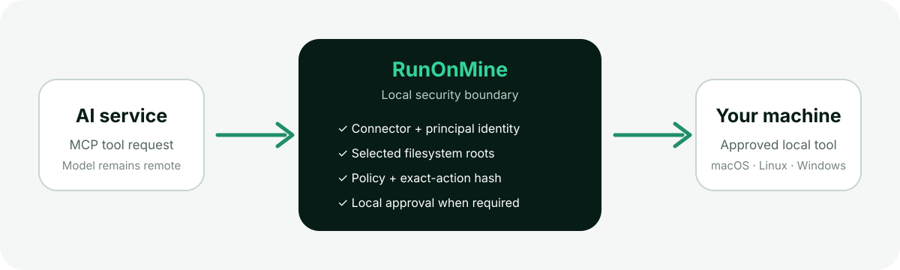

# Secure onboarding

RunOnMine is intentionally not a one-click remote shell. Initial setup makes the
machine boundary visible before any connector is exposed.



## 1. Install and select roots

Install the package for the current platform, then select only the project
directories the AI may access:

```console
runonmine setup --root /absolute/path/to/project
```

File tools use descriptor-relative operations below these roots. Selecting a
parent such as the whole home directory grants a much broader filesystem view
and is not recommended.

## 2. Keep the Safe profile first

Every new connector starts with **Safe**, which permits non-destructive reads
and asks locally before writes or execution. The available product profiles are:

| Product profile | CLI preset | Intended use |
| --- | --- | --- |
| **Safe** | `safe` | Read-oriented use with local approval for writes, shell, browser actions, desktop actions, and platform-native operations. Administrator execution is denied. |
| **Developer** | `developer` | Selected-root file writes and shell execution may run automatically. Browser and desktop actions still ask locally. Administrator execution is denied. |
| **Automation** | `full` | Broadest policy. Use only on a dedicated machine or narrowly scoped connector. Remote safety ceilings still apply unless a GitHub-owner-authenticated Cloudflare Named Tunnel was explicitly created with `--owner-full-access`. |

The optional privileged helper is not installed by setup and is not implied by
any preset. It has a separate explicit installation and executable-specific
command profile.

## 3. Add one connector

Local stdio has the smallest exposed surface. Authenticated loopback HTTP is an
explicit opt-in:

```console
runonmine connect local-http enable --token-output /absolute/private/credential.json
runonmine service install
```

The token is written only to the requested new owner-private file and the
operating-system credential store. It is never printed to terminal output.

## 4. Review exact actions

Requests that need approval appear in the desktop **Approvals** screen and the
local CLI. Review the concrete path, command, URL, selector, or script target.
An approval is bound to the connector, requester identity, tool, and argument
hash; a changed action asks again.

## 5. Use Emergency Lock

**Lock RunOnMine** is available in the desktop sidebar and native menu-bar
integration:

```console
runonmine lock
```

Lock stops the agent and managed connectors, rejects pending approvals, revokes
OAuth sessions, rotates temporary connector paths, and invalidates temporary
credentials. It does not silently delete the user's configuration.

## Operating-system permissions

RunOnMine does not bypass OS consent. Browser automation uses an isolated
profile. Desktop control may require Accessibility, Input Monitoring, or Screen
Recording permission depending on the tool. Grant only the permission required
for the intended workflow and remove it when no longer needed.

## What RunOnMine never does

- It never binds the MCP server to a public network interface.
- It never installs the privileged helper during normal setup.
- It never lets a remote connector approve its own dangerous request.
- It never gives ordinary remote connectors administrator execution; the only exception is an explicit owner-workstation Cloudflare Named Tunnel combined with Full policy and a separately installed administrator helper profile.
- It never starts the user's daily browser profile with remote debugging.
- It never treats a missing, corrupt, or unverifiable security state as safe.

Permanent removal requires an explicit purge after the service is removed:

```console
runonmine uninstall --purge --confirm PURGE
```
